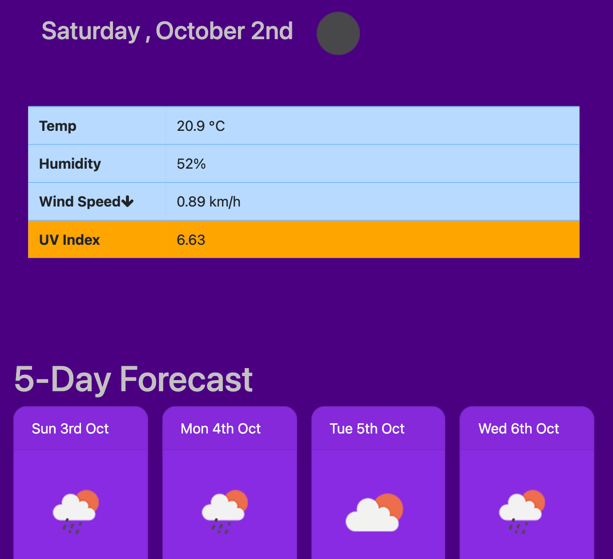

# weather-dashboard
Weather dashboard application with search functionality to find current weather conditions and the future weather outlook for multiple cities.

## About The Project

Developers are often tasked with retrieving data from another application's API and using it in the context of their own. Third-party APIs allow developers to access their data and functionality by making requests with specific parameters to a URL. This project will include building a weather dashboard using the OpenWeather API and/or DarkSky API as per user's spefications.

## User Stories

```
As a traveler
I want to see the weather outlook for multiple cities
so that I can plan a trip accordingly
```

## Development Strategy

* Use the [OpenWeather API](https://openweathermap.org/api) to retrieve weather data for cities. 

* Use AJAX to hook into the API to retrieve data in JSON format.

* App should be able to run in the browser and feature dynamically updated HTML and CSS powered by jQuery.

* Display the following under current weather conditions:

  * City
  * Date
  * Icon image (visual representation of weather conditions)
  * Temperature
  * Humidity
  * Wind speed
  * UV index

* Include a search history so that users can access their past search terms. Clicking on the city name should perform a new search that returns current and future conditions for that city. 

* Include a 5-Day Forecast below the current weather conditions. Each day for the 5-Day Forecast should display the following:

  * Date
  * Icon image (visual representation of weather conditions)
  * Temperature
  * Humidity

## Link and Demo

https://lukemcmi.github.io/Weather-Dashboard/



## User Specifications

- [x] Fully functional, deployed application.

- [x] GitHub repository with a unique name and a README describing the project.

- [x] User can search for weather reports by city using the openweathermap API.

- [x] After searching for a city, the following information is displayed:

  *  Current temperature
  *  Current humidity
  *  Windspeed
  *  Uv index
  *  5 day forecast